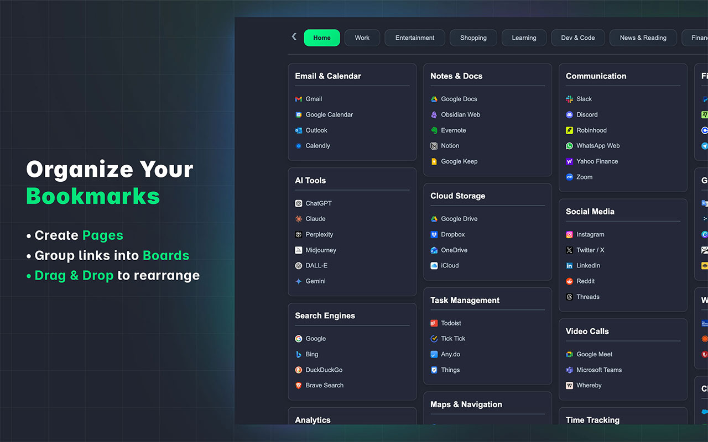
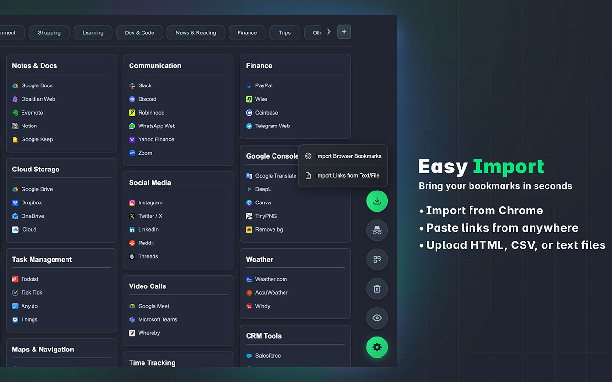
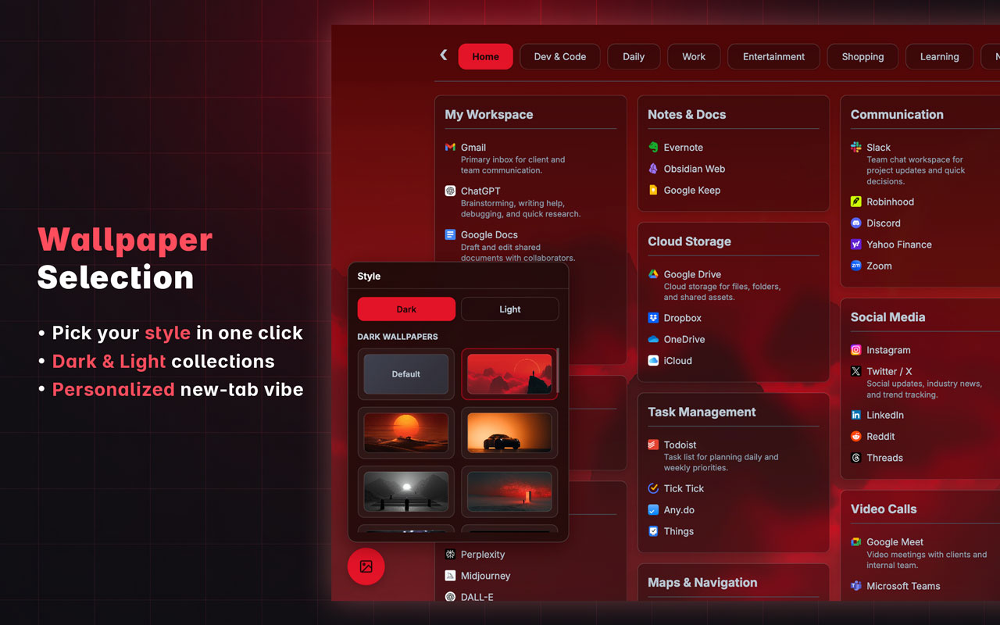
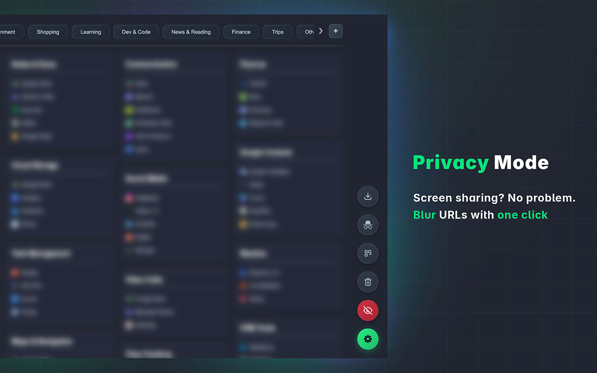

<div align="center">
  

  # Aura

  **A visual bookmark manager that replaces your New Tab with a beautiful, organized dashboard.**

  
  
  
</div>

---

## Overview

Aura turns Chrome's New Tab page into a customizable dashboard for all your links.
Group bookmarks into **Boards**, organize Boards across **Pages**, drag-and-drop to
rearrange everything, and save the current tab to your Inbox with a single shortcut.

> **Note:** This repository contains the **production build** of the extension
> (ready to load into Chrome). The minified UI bundle lives in [`assets/`](assets/).

## Features

- 🗂️ **Pages & Boards** — organize links into themed Boards (Email, AI Tools, Social, etc.) and group Boards under Pages (Home, Work, Dev & Code…).
- 🖱️ **Drag & drop** — rearrange Boards and links freely.
- ⚡ **Quick Save** — press `Ctrl+Shift+Y` (`⌘+Shift+Y` on macOS) to save the active tab to your Inbox, even when no New Tab is open.
- 📥 **Easy import** — bring in your existing Chrome bookmarks.
- 🖼️ **Custom wallpapers** — pick a background that suits your style.
- 🙈 **Privacy Mode** — blur every URL with one click, ideal for screen sharing.
- 🕵️ **Incognito-friendly** browsing layout.
- 🔗 **Rich link previews** — fetches Open Graph metadata (title, description, image) for nicer cards.

## Screenshots

| Organize | Easy Import |
| --- | --- |
|  |  |

| Wallpaper Selection | Privacy Mode |
| --- | --- |
|  |  |

## Installation (Load Unpacked)

1. Download or clone this repository:
   ```bash
   git clone https://github.com/ramisxh/aura-extension.git
   ```
2. Open Chrome and go to `chrome://extensions`.
3. Toggle **Developer mode** on (top-right).
4. Click **Load unpacked** and select the cloned folder (the one containing `manifest.json`).
5. Open a new tab — Aura takes over. 🎉

> Works in any Chromium-based browser (Chrome, Edge, Brave) that supports Manifest V3.

## Permissions

| Permission | Why it's needed |
| --- | --- |
| `bookmarks` | Read and organize your existing bookmarks. |
| `storage` | Save your boards, pages, and settings locally. |
| `tabs` / `activeTab` | Read the active tab's URL/title for Quick Save. |
| `host_permissions: <all_urls>` | Fetch Open Graph metadata so saved links get rich previews. |

All data stays in your browser's local storage — Aura has no backend server.

## Project Structure

```
.
├── manifest.json          # MV3 extension manifest
├── background.js          # Service worker: Quick Save + metadata fetch
├── index.html             # New Tab dashboard entry point
├── assets/                # Built UI bundle (JS + CSS)
├── icon16/48/128.png      # Extension icons
└── docs/screenshots/      # Promo screenshots used in this README
```

## License

[MIT](LICENSE) © 2026 ramisxh
